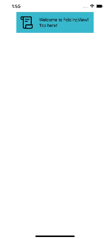

# FoldingViewSwiftUI

This package provides you with an easy way to show a headline view and some folding detail views such as following animation.



You can add this package on Xcode.
See [documentation](https://developer.apple.com/documentation/swift_packages/adding_package_dependencies_to_your_app).


## How to Use

You can just import FoldingViewSwiftUI to use the package.

```swift
import SwiftUI
import FoldingViewSwiftUI

struct ContentView: View
{
  var body: some View {
    ScrollView(showsIndicators: false) {
      FoldingView(duration: 0.3, headline: {
        ZStack {
          Color.teal
          HStack {
            Image(systemName: "scroll")
              .resizable()
              .frame(width: 48.0, height: 48.0)
              .padding()
            Text("Welcome to FoldingView!\nTap here!")
              .lineLimit(nil)
          }
          .foregroundColor(.black)
          .frame(maxWidth: .infinity, alignment: .leading)
        }.frame(maxWidth: 300.0, maxHeight: 80.0)
      }, details: [
        DetailView(title: "Detail Red", color: .red),
        DetailView(title: "Detail Green", color: .green),
        DetailView(title: "Detail Blue", color: .blue),
        DetailView(title: "Detail Orange", color: .orange, height: 150.0),
        DetailView(title: "Detail Purple", color: .purple, height: 280.0),
      ])
    }
  }

  struct DetailView: View
  {
    let title: String
    let color: Color
    var height: CGFloat = 80.0

    @ViewBuilder
    var body: some View {
      ZStack {
        color
        Text(title).font(.title)
      }
      .frame(minHeight: height)
      .frame(maxWidth: 300.0, maxHeight: height)
    }
  }
}
```

## License

This package is licensed under [BSD License](LICENSE)
